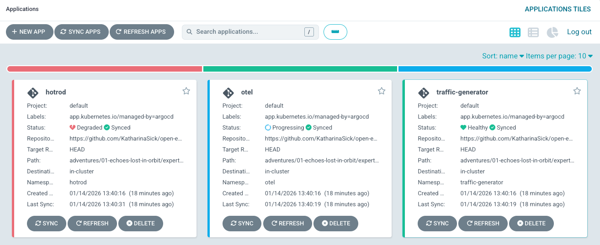
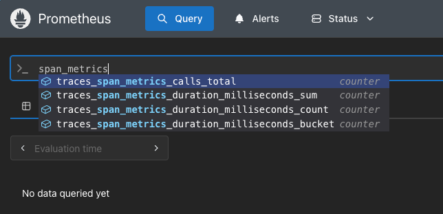

# 🔴 Expert Solution Walkthrough: Hyperspace Operations & Transport

In this walkthrough, we'll approach the challenge exactly as you would: start with the objectives, break them down one by one, and systematically fix what's broken. 🚀

> ⚠️ **Spoiler Alert:** This walkthrough contains the full solution to the challenge. We encourage you to try solving it on your own first. Consider coming back here only if you get stuck or want to check your approach.

## 📋 Step 1: Review the Challenge Objectives

Let's start by reading what we need to achieve. The challenge states:

> By the end of this level, you should have:
>
> - Automated rollout progression to HotROD version 1.76.0 driven by observability signals
> - OpenTelemetry Collector configured with:
>       - OTLP receiver for traces from HotROD
>       - Spanmetrics connector converting traces as metrics
>       - Trace export to Jaeger, metrics export to Prometheus
> - Canary analysis validating deployments with 3 queries:
>       - Traffic detection ensuring minimum request rate (>= 0.05 req/s) to the canary to prevent idle canaries that get promoted but never had real traffic. You can use the hotrod_requests_total metric to verify this
>       - Error rate thresholds (< 5%)
>       - Latency thresholds for the 95th percentile (< 1000ms)

Perfect! Now we have three clear objectives to work toward. Let's tackle them one by one.

## 🔍 Step 2: Understand the Setup

Before we start fixing things, let's understand what we're working with. All files are located in the following path:

```bash
adventures/01-echoes-lost-in-orbit/expert/manifests
```

Let's see what it contains:

- `appset.yaml`: An [Argo CD ApplicationSet](https://argo-cd.readthedocs.io/en/stable/operator-manual/applicationset/) that deploys the 3 applications listed below using the Git directory generator
- `hotrod/`: The configuration for the HotROD app
    - `analysis-template.yaml`: An [Argo Rollouts AnalysisTemplate](https://argo-rollouts.readthedocs.io/en/stable/features/analysis/) that defines health checks during canary deployments
    - `rollout.yaml`: An [Argo Rollouts Rollout](https://argo-rollouts.readthedocs.io/en/stable/) resource that manages the canary deployment strategy
    - `service.yaml`: A Kubernetes Service that exposes the HotROD app
- `otel/`: The configuration for the [OpenTelemetry Collector](https://opentelemetry.io/docs/collector/)
    - `config.yaml`: OpenTelemetry Collector configuration
    - `daemonset.yaml`: Kubernetes DaemonSet that runs the OpenTelemetry Collector
    - `service.yaml`: A Kubernetes Service that exposes the OpenTelemetry Collector
- `traffic-generator/`: A simple app that sends traffic to the HotROD service
    - `deployment.yaml`: Kubernetes Deployment for the traffic generator

Now let's work through each objective.

## 🎯 Step 3: Clear Objectives

### Objective 1: Automated rollout progression to HotROD version 1.76.0 driven by observability signals

This objective depends on fixing the other objectives first. Let's move on for now.

But before we jump into the other objectives, let's open Argo CD and see what's there.



We can see 3 apps (matching those defined in the ApplicationSet):

- `hotrod`: The HotROD app. This is broken because the last `AnalysisRun` failed. That's expected and therefore okay for now.
- `otel`: The OpenTelemetry Collector. This app is progressing because the collector keeps crashing with the error `invalid configuration: no receiver configuration specified in config`. We need to fix the collector configuration to get this app working. Since this is part of Objective 2, let's move on for now.
- `traffic-generator`: The traffic generator app. This app is healthy and running. Perfect!

### Objective 2: OpenTelemetry Collector configured

According to the objective, we need to configure 3 things:

- OTLP receiver for traces from HotROD
- Spanmetrics connector converting traces as metrics
- Trace export to Jaeger, metrics export to Prometheus

Let's take a look at the `otel/config.yaml` file to find out what's already there and what's missing:

```yaml
apiVersion: v1
kind: ConfigMap
metadata:
  name: collector-config
  labels:
    app: collector
data:
  collector-config.yaml: |
    receivers:

    connectors:
      spanmetrics:
        dimensions:
          - name: hotrod.namespace
          - name: hotrod.pod.name
          - name: hotrod.pod.hash

    exporters:
      debug:
        verbosity: detailed
      otlp:
        endpoint: jaeger-collector.jaeger.svc.cluster.local:4317
        tls:
          insecure: true

    extensions:
      health_check:
        endpoint: 0.0.0.0:13133

    service:
      extensions: [health_check]
      pipelines:
        traces:
          receivers: [otlp]
          exporters: [debug, otlp, spanmetrics]
```

An OpenTelemetry Collector config has several main sections. Here's what each of them does in a nutshell:

- **[Receivers](https://opentelemetry.io/docs/collector/configuration/#receivers)**: Define how the collector receives data (e.g., OTLP, Jaeger, Zipkin)
- **[Processors](https://opentelemetry.io/docs/collector/configuration/#processors)**: Transform, filter, or enrich data before exporting (e.g., batch, memory limiter, attributes)
- **[Connectors](https://opentelemetry.io/docs/collector/configuration/#connectors)**: Connect two pipelines, acting as both exporter and receiver (e.g., spanmetrics converts traces to metrics)
- **[Exporters](https://opentelemetry.io/docs/collector/configuration/#exporters)**: Define where the collector sends the data (e.g., Jaeger, Prometheus, OTLP)
- **[Service Pipelines](https://opentelemetry.io/docs/collector/configuration/#service)**: Define the flow of data through receivers, processors, connectors, and exporters

You can read more about this in the [OpenTelemetry Collector documentation](https://opentelemetry.io/docs/collector/configuration/).

**OTLP receiver for traces from HotROD**

With that knowledge, the first thing we notice is that the `receivers` section is empty. That means the collector can't receive any data from HotROD. We need to add an OTLP receiver here.

The question is: what configuration does it need? Does HotROD send traces via OTLP over gRPC or HTTP?

Let's check the `rollout.yaml` file in the `hotrod/` folder to find out. There we can see:

```yaml
env:
  - name: OTEL_EXPORTER_OTLP_ENDPOINT
    value: "http://collector.otel.svc.cluster.local:4318"
```

Port `4318` is the default port for OTLP/HTTP according to the [OpenTelemetry Collector docs](https://opentelemetry.io/docs/specs/otlp/#otlphttp).

Let's add an OTLP receiver configured for HTTP:

```yaml
    receivers:
      otlp:
        protocols:
          http:
            endpoint: 0.0.0.0:4318
```

With that, the "OTLP receiver for traces from HotROD" is configured. Let's move on to the next one.

**Spanmetrics connector converting traces as metrics**

Looking at the `connectors` section, we can see that the `spanmetrics` connector is already defined. Spanmetrics traces are also already exported in the traces pipeline.

Let's create a metrics pipeline to export the generated metrics. We can do that by adding a new `metrics` pipeline in the `service` section. For now, let's only export to debug. With that, the spanmetrics connector will convert traces into metrics and export them.

Here's how the updated `service` section looks:

```yaml
      pipelines:
        traces:
          ... # existing traces pipeline
        metrics:
          receivers: [ spanmetrics ]
          exporters: [ debug ]
```

**Trace export to Jaeger, metrics export to Prometheus**

Now that we have all the metrics and traces we need, we just need to export them to the right endpoints.

Let's start with exporting traces to Jaeger. Checking the config, traces are already exported to an OTLP exporter which points to Jaeger. Perfect! That means trace export to Jaeger is already configured. Let's export metrics to Prometheus.

For that, we need to add a Prometheus exporter in the `exporters` section and add it to the `metrics` pipeline. Let's check the [OpenTelemetry Collector docs](https://github.com/open-telemetry/opentelemetry-collector-contrib/tree/main/exporter/prometheusexporter) on how to configure the Prometheus exporter.

According to the docs, we can add the following configuration:

```yaml
    exporters:
      ... # existing exporters
      prometheus:
        endpoint: "1.2.3.4:1234"
```

But what port should we use?

Let's check the `daemonset.yaml` in the `otel/` folder. There we can see that the collector exposes port `8889` for Prometheus metrics (look for the port named `prometheus`). The pod annotations also confirm this with `prometheus.io/port: "8889"`. This means Prometheus is already configured to scrape metrics from this port.

So the correct configuration is:

```yaml
    exporters:
      ... # existing exporters
      prometheus:
        endpoint: "0.0.0.0:8889"
```

We use `0.0.0.0` to listen on all interfaces so Prometheus can scrape the metrics from outside the container.

Awesome! Now we just need to add the Prometheus exporter to the `metrics` pipeline:

```yaml
      pipelines:
        ... # existing pipelines
        metrics:
          receivers: [ spanmetrics ]
          exporters: [ debug, prometheus ]
```

Let's push these changes, let Argo CD pick them up, restart the collector, and see if we can get the OpenTelemetry Collector working.

```bash
argocd app get otel --refresh
kubectl rollout restart daemonset/collector -n otel
```

Nice! After pushing and letting Argo CD sync the changes, the OpenTelemetry Collector is now healthy. We can also see metrics arriving in Prometheus and traces in Jaeger. Objective 2 is complete!

Jaeger:


Prometheus:



Here's the full OpenTelemetry Collector config:

```yaml
apiVersion: v1
kind: ConfigMap
metadata:
  name: collector-config
  labels:
    app: collector
data:
  collector-config.yaml: |
    receivers:
      otlp:
        protocols:
          http:
            endpoint: 0.0.0.0:4318

    connectors:
      spanmetrics:
        dimensions:
          - name: hotrod.namespace
          - name: hotrod.pod.name
          - name: hotrod.pod.hash

    exporters:
      debug:
        verbosity: detailed
      otlp:
        endpoint: jaeger-collector.jaeger.svc.cluster.local:4317
        tls:
          insecure: true
      prometheus:
        endpoint: "0.0.0.0:8889"

    extensions:
      health_check:
        endpoint: 0.0.0.0:13133

    service:
      extensions: [health_check]
      pipelines:
        traces:
          receivers: [otlp]
          exporters: [debug, otlp, spanmetrics]
        metrics:
          receivers: [ spanmetrics ]
          exporters: [ debug, prometheus ]
```

#### Key Takeaways

- The OpenTelemetry Collector is highly configurable with receivers, processors/connectors, exporters, and service pipelines.
- The OTLP receiver allows the collector to receive traces from applications instrumented with OpenTelemetry.
- The Spanmetrics connector can convert traces into metrics, enabling advanced analysis and monitoring.
- Pipelines define the flow of data through the collector, allowing for flexible data processing and exporting.

#### Further Reading

- [OpenTelemetry Collector Documentation](https://opentelemetry.io/docs/collector/)
- [Span Metrics Connector](https://github.com/open-telemetry/opentelemetry-collector-contrib/tree/main/connector/spanmetricsconnector)
- [Prometheus Exporter for OpenTelemetry Collector](https://github.com/open-telemetry/opentelemetry-collector-contrib/tree/main/exporter/prometheusexporter)

### Objective 3: Canary analysis validating deployments

This objective tells us that we need to configure the AnalysisTemplate with 3 queries:

- Traffic detection ensuring minimum request rate (>= 0.05 req/s) to the canary to prevent "idle canaries" that get promoted but never had real traffic. You can use the hotrod_requests_total metric to verify this.
- Error rate thresholds (< 5%)
- Latency thresholds for the 95th percentile (< 1000ms)

Let's check the AnalysisTemplate in `hotrod/analysis-template.yaml` to see what's already there:

```yaml
apiVersion: argoproj.io/v1alpha1
kind: AnalysisTemplate
metadata:
  name: hotrod-analysis
spec:
  args:
    - name: namespace
    - name: canary-hash
  metrics:
    - name: error-rate-lt-5-percent
      initialDelay: 60s
      interval: 10s
      count: 3
      successCondition: result[0] < 0.05
      failureLimit: 2
      inconclusiveLimit: 3
      consecutiveErrorLimit: 2
      provider:
        prometheus:
          address: http://prometheus-server.prometheus.svc.cluster.local
          query: |
            # Error rate: ratio of failed requests to total requests
            sum(rate(hotrod_requests_total{
              namespace="{{args.namespace}}",
              rollouts_pod_template_hash="{{args.canary-hash}}",
              error="true"
            }[2m])) 
            /
            sum(rate(hotrod_requests_total{
              namespace="{{args.namespace}}",
              rollouts_pod_template_hash="{{args.canary-hash}}"
            }[2m]))

    - name: latency-p95-lt-1s
      initialDelay: 90s
      interval: 10s
      count: 3
      successCondition: result[0] < 1000
      failureLimit: 2
      inconclusiveLimit: 3
      consecutiveErrorLimit: 2
      provider:
        prometheus:
          address: http://prometheus-server.prometheus.svc.cluster.local
          query: |
            # P95 latency: should be under 1 second
            histogram_quantile(0.95,
              sum by (le) (rate(traces_span_metrics_duration_milliseconds_bucket{
                hotrod_namespace="{{args.namespace}}",
                hotrod_pod_hash="{{args.canary-hash}}"
              }[2m]))
            )
```

Let's also open the Argo Rollouts dashboard and see the status of the last analysis run. We can see that the first check `error-rate-lt-5-percent` succeeded, but the second check `latency-p95-lt-1s` failed with `index out of range`.


Let's take one step back and check and fix the queries one by one.

**Traffic detection (>= 0.05 req/s)**

The existing queries check for error rate and latency, but there's no query for traffic detection. This metric ensures the canary receives real traffic before promotion—without it, a canary could be promoted even if it never handled any requests.

Let's add a new metric. The configuration is explained in the comments:

```yaml
  metrics:
    # This metric ensures the canary is receiving real traffic before promotion.
    # Without this check, a canary could be promoted even if it never handled
    # any requests (e.g., due to routing issues or no traffic at all).
    - name: traffic-detection
      initialDelay: 90s # Wait 90 seconds before the first check to allow traffic to flow
      interval: 10s # Check every 10 seconds
      count: 5 # Run 5 measurements total
      successCondition: result[0] >= 0.05 # Success if there are at least 0.05 req/s (ensures real traffic)
      failureLimit: 3 # Allow up to 3 failures before marking the analysis as failed
      inconclusiveLimit: 5 # Allow up to 5 inconclusive results (e.g., no data yet)
      consecutiveErrorLimit: 3 # Allow up to 3 consecutive errors (e.g., Prometheus unavailable)
      provider:
        prometheus:
          address: http://prometheus-server.prometheus.svc.cluster.local
          # Calculate the per-second request rate over the last 2 minutes
          # for the canary pods only (filtered by namespace and pod hash)
          query: |
            sum(rate(hotrod_requests_total{
              namespace="{{args.namespace}}",
              rollouts_pod_template_hash="{{args.canary-hash}}"
            }[2m]))
```

With that, we're checking if there is traffic and avoiding idle canaries. Let's move on to the next one.

**Error rate thresholds (< 5%)**

A metric for this already exists:

```yaml
    - name: error-rate-lt-5-percent
      initialDelay: 60s
      interval: 10s
      count: 3
      successCondition: result[0] < 0.05
      failureLimit: 2
      inconclusiveLimit: 3
      consecutiveErrorLimit: 2
      provider:
        prometheus:
          address: http://prometheus-server.prometheus.svc.cluster.local
          query: |
            # Error rate: ratio of failed requests to total requests
            sum(rate(hotrod_requests_total{
              namespace="{{args.namespace}}",
              rollouts_pod_template_hash="{{args.canary-hash}}",
              error="true"
            }[2m])) 
            /
            sum(rate(hotrod_requests_total{
              namespace="{{args.namespace}}",
              rollouts_pod_template_hash="{{args.canary-hash}}"
            }[2m]))
```

This metric succeeded in the last analysis run. After checking it again to be sure, it looks good. No changes needed here.

**Latency thresholds for the 95th percentile (< 1000ms)**

A metric for this already exists:

```yaml
    - name: latency-p95-lt-1s
      initialDelay: 90s
      interval: 10s
      count: 3
      successCondition: result[0] < 1000
      failureLimit: 2
      inconclusiveLimit: 3
      consecutiveErrorLimit: 2
      provider:
        prometheus:
          address: http://prometheus-server.prometheus.svc.cluster.local
          query: |
            # P95 latency: should be under 1 second
            histogram_quantile(0.95,
              sum by (le) (rate(traces_span_metrics_duration_milliseconds_bucket{
                hotrod_namespace="{{args.namespace}}",
                hotrod_pod_hash="{{args.canary-hash}}"
              }[2m]))
            )
```

This one failed in the last analysis run with this error:

```
Metric "latency-p95-lt-1s" assessed Error due to consecutiveErrors (3) > consecutiveErrorLimit (2): "Error Message: reflect: slice index out of range"
```

But when looking at it, everything looks fine. Thinking about this again, this failed before we had the OpenTelemetry Collector working. That means no metrics about traces were arriving in Prometheus at all.

Now that we have the OpenTelemetry Collector working, let's push our changes, refresh the Argo CD app, and retry the rollout to see if this works now.

```bash
argocd app get hotrod --refresh
kubectl argo rollouts retry rollout hotrod -n hotrod
```

Nice! The analysis run succeeded and we can be sure that we're actually checking an app with real traffic now.


Here's the full `AnalysisTemplate` with all 3 metrics:

```yaml
apiVersion: argoproj.io/v1alpha1
kind: AnalysisTemplate
metadata:
  name: hotrod-analysis
spec:
  args:
    - name: namespace
    - name: canary-hash
  metrics:
    - name: traffic-detection
      initialDelay: 90s # Wait 90 seconds before the first check to allow traffic to flow
      interval: 10s # Check every 10 seconds
      count: 5 # Run 5 measurements total
      successCondition: result[0] >= 0.05 # Success if there are at least 0.05 req/s (ensures real traffic)
      failureLimit: 3 # Allow up to 3 failures before marking the analysis as failed
      inconclusiveLimit: 5 # Allow up to 5 inconclusive results (e.g., no data yet)
      consecutiveErrorLimit: 3 # Allow up to 3 consecutive errors (e.g., Prometheus unavailable)
      provider:
        prometheus:
          address: http://prometheus-server.prometheus.svc.cluster.local
          # Calculate the per-second request rate over the last 2 minutes
          # for the canary pods only (filtered by namespace and pod hash)
          query: |
            sum(rate(hotrod_requests_total{
              namespace="{{args.namespace}}",
              rollouts_pod_template_hash="{{args.canary-hash}}"
            }[2m]))
    - name: error-rate-lt-5-percent
      initialDelay: 60s
      interval: 10s
      count: 3
      successCondition: result[0] < 0.05
      failureLimit: 2
      inconclusiveLimit: 3
      consecutiveErrorLimit: 2
      provider:
        prometheus:
          address: http://prometheus-server.prometheus.svc.cluster.local
          query: |
            # Error rate: ratio of failed requests to total requests
            sum(rate(hotrod_requests_total{
              namespace="{{args.namespace}}",
              rollouts_pod_template_hash="{{args.canary-hash}}",
              error="true"
            }[2m])) 
            /
            sum(rate(hotrod_requests_total{
              namespace="{{args.namespace}}",
              rollouts_pod_template_hash="{{args.canary-hash}}"
            }[2m]))

    - name: latency-p95-lt-1s
      initialDelay: 90s
      interval: 10s
      count: 3
      successCondition: result[0] < 1000
      failureLimit: 2
      inconclusiveLimit: 3
      consecutiveErrorLimit: 2
      provider:
        prometheus:
          address: http://prometheus-server.prometheus.svc.cluster.local
          query: |
            # P95 latency: should be under 1 second
            histogram_quantile(0.95,
              sum by (le) (rate(traces_span_metrics_duration_milliseconds_bucket{
                hotrod_namespace="{{args.namespace}}",
                hotrod_pod_hash="{{args.canary-hash}}"
              }[2m]))
            )

```

#### Key Takeaways

- If there's no traffic, canary deployments can be promoted without ever being tested under real conditions.
- Argo Rollouts AnalysisTemplates can use traces for verification when converting them to metrics with the Spanmetrics connector.

#### Further Reading

- [Argo Rollouts Analysis Documentation](https://argo-rollouts.readthedocs.io/en/stable/features/analysis/)
- [PromQL Basics](https://prometheus.io/docs/prometheus/latest/querying/basics/)

## ✅ Complete Solution

Here's what your corrected files should look like with all fixes applied:

**OpenTelemetry Collector Config:**
```yaml
apiVersion: v1
kind: ConfigMap
metadata:
  name: collector-config
  labels:
    app: collector
data:
  collector-config.yaml: |
    receivers:
      otlp:
        protocols:
          http:
            endpoint: 0.0.0.0:4318

    connectors:
      spanmetrics:
        dimensions:
          - name: hotrod.namespace
          - name: hotrod.pod.name
          - name: hotrod.pod.hash

    exporters:
      debug:
        verbosity: detailed
      otlp:
        endpoint: jaeger-collector.jaeger.svc.cluster.local:4317
        tls:
          insecure: true
      prometheus:
        endpoint: "0.0.0.0:8889"

    extensions:
      health_check:
        endpoint: 0.0.0.0:13133

    service:
      extensions: [health_check]
      pipelines:
        traces:
          receivers: [otlp]
          exporters: [debug, otlp, spanmetrics]
        metrics:
          receivers: [ spanmetrics ]
          exporters: [ debug, prometheus ]
```

**Analysis Template:**

```yaml
apiVersion: argoproj.io/v1alpha1
kind: AnalysisTemplate
metadata:
  name: hotrod-analysis
spec:
  args:
    - name: namespace
    - name: canary-hash
  metrics:
    - name: traffic-detection
      initialDelay: 90s # Wait 90 seconds before the first check to allow traffic to flow
      interval: 10s # Check every 10 seconds
      count: 5 # Run 5 measurements total
      successCondition: result[0] >= 0.05 # Success if there are at least 0.05 req/s (ensures real traffic)
      failureLimit: 3 # Allow up to 3 failures before marking the analysis as failed
      inconclusiveLimit: 5 # Allow up to 5 inconclusive results (e.g., no data yet)
      consecutiveErrorLimit: 3 # Allow up to 3 consecutive errors (e.g., Prometheus unavailable)
      provider:
        prometheus:
          address: http://prometheus-server.prometheus.svc.cluster.local
          # Calculate the per-second request rate over the last 2 minutes
          # for the canary pods only (filtered by namespace and pod hash)
          query: |
            sum(rate(hotrod_requests_total{
              namespace="{{args.namespace}}",
              rollouts_pod_template_hash="{{args.canary-hash}}"
            }[2m]))
    - name: error-rate-lt-5-percent
      initialDelay: 60s
      interval: 10s
      count: 3
      successCondition: result[0] < 0.05
      failureLimit: 2
      inconclusiveLimit: 3
      consecutiveErrorLimit: 2
      provider:
        prometheus:
          address: http://prometheus-server.prometheus.svc.cluster.local
          query: |
            # Error rate: ratio of failed requests to total requests
            sum(rate(hotrod_requests_total{
              namespace="{{args.namespace}}",
              rollouts_pod_template_hash="{{args.canary-hash}}",
              error="true"
            }[2m])) 
            /
            sum(rate(hotrod_requests_total{
              namespace="{{args.namespace}}",
              rollouts_pod_template_hash="{{args.canary-hash}}"
            }[2m]))

    - name: latency-p95-lt-1s
      initialDelay: 90s
      interval: 10s
      count: 3
      successCondition: result[0] < 1000
      failureLimit: 2
      inconclusiveLimit: 3
      consecutiveErrorLimit: 2
      provider:
        prometheus:
          address: http://prometheus-server.prometheus.svc.cluster.local
          query: |
            # P95 latency: should be under 1 second
            histogram_quantile(0.95,
              sum by (le) (rate(traces_span_metrics_duration_milliseconds_bucket{
                hotrod_namespace="{{args.namespace}}",
                hotrod_pod_hash="{{args.canary-hash}}"
              }[2m]))
            )
```

With these changes, your rollouts will now progress automatically through canary stages based on health metrics. This also means Objective 1 is now achieved—the rollout will automatically progress to HotROD version 1.76.0 driven by the observability signals we configured. All objectives of the challenge are met. Great job! 🎉
