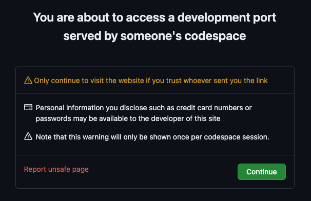
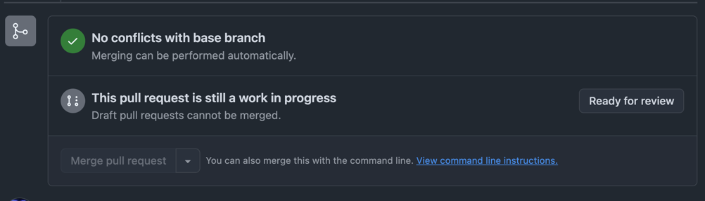

# 🔴 Expert: The Guardian Protocols

After the Modular Metropolis refactoring, CloudHaven flourished. But with growth came risk. One night, a rogue change
slipped through unnoticed and nearly brought down the North Market's trading vaults. The Council was furious — how could
this happen without anyone noticing?

The Guild Master summoned you urgently. "We need guardians," she said, "automated sentinels that watch over our
infrastructure day and night. They must catch dangerous changes before they reach the city, detect when reality drifts
from our blueprints, and sound the alarm when threats appear."

A previous engineer began building these Guardian Protocols using GitHub Actions, but was reassigned before completing
them. The workflows exist, but they're incomplete and broken. Your mission: bring the Guardian Protocols online and
protect CloudHaven from chaos.

## ⏰ Deadline

Wednesday, 4 February 2026 at 23:59 CET

> ℹ️ You can still complete the challenge after this date, but points will only be awarded for submissions before the
> deadline.

## 💬 Join the discussion

Share your solutions and questions in
the [challenge thread](https://community.open-ecosystem.com/t/adventure-02-building-cloudhaven-expert-the-guardian-protocols/782)
in the Open Ecosystem Community.

## 🎯 Objective

By the end of this level, your workflows should:

- **Detect infrastructure drift**
    - Run `tofu plan` to check for changes
    - Create a PR when drift is found
- **Validate pull requests**
    - Run `tofu plan` and comment results on the PR
    - Run tests against the mock GCP API
    - Scan for security vulnerabilities and comment results on the PR
    - Fail on critical or high severity vulnerabilities
- **Apply infrastructure automatically**
    - Apply changes when a PR is merged to main

All three workflows must have succeeded at least once.

## 🧠 What You'll Learn

- [GitHub Actions](https://docs.github.com/en/actions) workflows for infrastructure automation
- Infrastructure drift detection with `tofu plan`
- Security scanning with [Trivy](https://trivy.dev/)
- Running integration tests with [service containers](https://docs.github.com/en/actions/use-cases-and-examples/using-containerized-services/about-service-containers)
- The [TF-via-PR](https://github.com/OP5dev/TF-via-PR) action for plan/apply workflows

## 🧰 Toolbox

Your Codespace comes pre-configured with the following tools to help you solve the challenge:

- [`tofu`](https://opentofu.org/): The OpenTofu CLI for infrastructure provisioning
- [`gcp-api-mock`](https://github.com/KatharinaSick/gcp-api-mock): A mock GCP API running locally to simulate cloud
  resources without real cloud costs
- [GitHub Actions](https://docs.github.com/en/actions): The workflows you'll be fixing are in `.github/workflows/`

> ⚠️ **Note:** The mock API only supports Cloud Storage and Cloud SQL, and only the functions needed for this challenge
> have been properly tested.

## ✅ How to Play

### 1. Start Your Challenge

> 📖 **First time?** Check out the [Getting Started Guide](../../start-a-challenge) for detailed instructions on
> forking, starting a Codespace, and waiting for infrastructure setup.

Quick start:

- Fork the [repo](https://github.com/dynatrace-oss/open-ecosystem-challenges/)
- Create a Codespace
- Select "🌆 Adventure 02 | 🔴 Expert (The Guardian Protocols)"
- Wait ~2 minutes for the environment to initialize (`Cmd/Ctrl + Shift + P` → `View Creation Log` to view progress)

### 2. Access the GCP API Mock UI

- Open the **Ports** tab in the bottom panel
- Find the **GCP API Mock** row (port `30104`) and click the forwarded address
- This UI lets you explore the mock cloud resources (buckets, databases) created by your OpenTofu configuration

> ℹ️ **Note:** You may see a warning when accessing the port. This is expected: the port is set to public so that
> GitHub Actions runners can access the mock API during workflow runs. Click **"Continue"** to proceed.
>
> 

### 3. Fix the Workflows

The previous engineer started building the Guardian Protocols but left before finishing. The workflows exist but are
incomplete and broken.

Review the [🎯 Objective](#objective) section to understand what a successful solution looks like.

> ℹ️ **Note:** The OpenTofu configuration is correct. You don't need to modify any `.tf` files. Focus on fixing the
> GitHub Actions workflows.

#### How the Workflows Should Work Together

Once fixed, the Guardian Protocols work like this:

- **Drift Detection:** Trigger manually via the GitHub Actions UI. If drift is detected, a draft PR is created with
   a drift log entry.
> ℹ️ The infrastructure has intentional drift. The workflow should detect changes and create a PR.

- **Mark PR Ready for Review:** The PR is created as a draft intentionally. You must click "Ready for Review" to
   trigger the validation workflow. This is a
   [GitHub Actions limitation](https://github.com/peter-evans/create-pull-request/blob/main/docs/concepts-guidelines.md#triggering-further-workflow-runs).


- **Validation:** Once the PR is ready for review, the validation workflow runs tests and security scans.

- **Apply:** When the PR is merged to main, the apply workflow automatically reconciles the infrastructure.

#### Where to Look

The workflows are located in:

```
.github/workflows/
├── adventure02-expert-detect-drift.yaml            # Drift detection workflow
├── adventure02-expert-validate-changes.yaml        # PR validation workflow
└── adventure02-expert-apply-infrastructure.yaml    # Apply workflow
```

#### Deploy Your Changes

After making your fixes, commit and push them to main:

```bash
git add .github/workflows/
git commit -m "Fix workflows"
git push
```

To test your changes on an existing PR:

1. Go to your PR
2. Click **"Convert to draft"** (under "Reviewers" on the right)
3. Click **"Ready for review"** again

This re-triggers the validation workflow with your latest changes.

> ℹ️ **Tip:** Re-running a failed workflow uses the code from the original run. Use the draft toggle above to pick up
> new changes pushed to main.

To trigger the drift detection workflow manually:

1. Go to the **Actions** tab in your repository
2. Select **"🌆🔴 | 🔍 Detect Infrastructure Drift"**
3. Click **"Run workflow"**

#### Helpful Documentation

- [GitHub Actions](https://docs.github.com/en/actions)
- [GitHub Actions Service Containers](https://docs.github.com/en/actions/use-cases-and-examples/using-containerized-services/about-service-containers)
- [OpenTofu Plan Command](https://opentofu.org/docs/cli/commands/plan/)
- [Trivy Action](https://github.com/aquasecurity/trivy-action)
- [TF-via-PR Action](https://github.com/OP5dev/TF-via-PR)

### 4. Verify Your Solution

Once you think you've solved the challenge, it's time to verify!

#### Run the Smoke Test

Run the provided smoke test script from the challenge directory:

```bash
cd adventures/02-building-cloudhaven/expert
./smoke-test.sh
```

If the test passes, your solution is very likely correct! 🎉

#### Complete Full Verification

For comprehensive validation and to officially claim completion:

1. **Commit and push your changes** to your fork
2. **Manually trigger the verification workflow** on GitHub Actions
3. **Share your success** with the [community](https://community.open-ecosystem.com/t/adventure-02-building-cloudhaven-expert-the-guardian-protocols)

> 📖 **Need detailed verification instructions?** Check out the [Verification Guide](../../verification) for
> step-by-step instructions on both smoke tests and GitHub Actions workflows.
